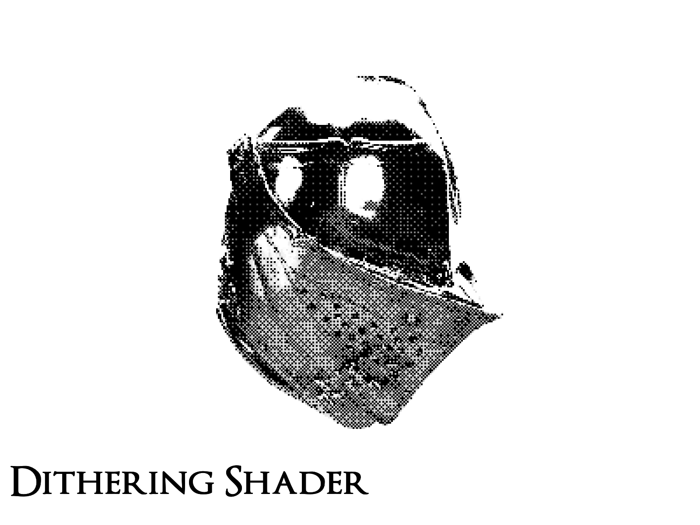

# Dithering Shader

*A dithering shader implementation with React Three Fiber demonstrating halftoning techniques and post-processing effects in WebGL.*



[Article on Codrops](https://tympanus.net/codrops/?p=)

[Demo](https://tympanus.net/Development/DitheringShader/)

## Features

- Custom dithering effect with 4x4 pixel pattern
- Dynamic adjustment of grid size and pixel ratio
- Pre and post dithering bloom effects
- Configurable grayscale mode
- Interactive controls for all shader parameters
- 3D model with custom environment map lighting
- Responsive design

## Installation

```bash
# Install dependencies
yarn

# Start development server
yarn dev

# Build for production
yarn build
```

## How the Shader Works

The dithering shader implements a halftoning technique based on a 4x4 pattern matrix.
The process works as follows:

1. The image is first pixelated based on grid size and pixel size ratio
2. Luminance is calculated for each pixel
3. Based on pixel position and luminance, a dithering pattern is applied
4. The effect can be applied in grayscale or color mode

## Controls

The interface allows adjusting various parameters:

- **Dithering Effect Resolution**: Adjusts the dithering grid size
- **Pixelation Strength**: Intensifies the pixelation effect
- **Grayscale Only**: Toggles black and white mode
- **Bloom (Pre/Post Dithering)**: Add bloom effects before or after dithering
- **Environment Settings**: Adjust lighting intensity and highlight color

## Credits

- 3D Model: [Jousting Helmet](https://sketchfab.com/3d-models/jousting-helmet-a4eea31d9d9441af9434a7da5ae46b54) by The Royal Armoury, CC-BY-4.0 license
- Original Dithering Pattern: [Shadertoy](https://www.shadertoy.com/view/ltSSzW)
- Environment lighting: Inspired by [@0xca0a](https://x.com/0xca0a/status/1857444050707640651)

## Misc

Follow Codrops: [Bluesky](https://bsky.app/profile/codrops.bsky.social), [Facebook](http://www.facebook.com/codrops), [GitHub](https://github.com/codrops), [Instagram](https://www.instagram.com/codropsss/), [X](http://www.x.com/codrops)

## License
[MIT](LICENSE)